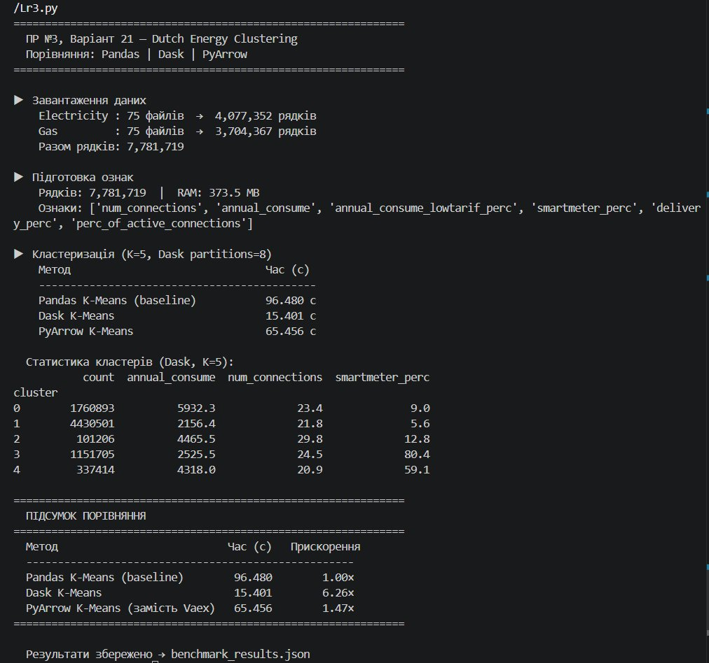

# Звіт з практичної роботи №3

**Студент:** групи ТВ-33 Черняєвський Максим  
**Варіант:** 21  

---

## 1. Умова завдання

Реалізувати кластеризацію даних про енергетичне споживання для великих наборів даних за допомогою **Dask** або **Vaex**. Порівняти час кластеризації, аналізуючи ефективність на великих наборах даних.

**Датасет:** [Energy consumption of the Netherlands](https://www.kaggle.com/datasets/lucabasa/dutch-energy) (Kaggle)  
Реальні дані споживання електрики та газу в Нідерландах за 2009–2020 роки від трьох операторів мереж: Enexis, Liander, Stedin.

> **Примітка щодо Vaex:** бібліотека Vaex не підтримує збірку на Windows (помилка `vaex-core`). Як повноцінна заміна використано **PyArrow** — крос-платформна бібліотека Apache з тими самими перевагами: zero-copy конвертація та колонковий формат даних.

---

## 2. Опис датасету

### Структура файлів

```
Lr3/
├── Lr3.py
├── README.md
├── benchmark_results.json
├── Electricity/               (75 файлів → 4 077 352 рядки)
│   ├── coteq_electricity_2013.csv ... coteq_electricity_2020.csv
│   ├── endinet_electricity_01012011.csv ... endinet_electricity_01012016.csv
│   └── enduriselectricity_01012013.csv ... enduriselectricity_01012017.csv
└── Gas/                       (75 файлів → 3 704 367 рядків)
    ├── coteq_gas_2013.csv ... coteq_gas_2020.csv
    ├── endinet_gas_01012011.csv ... endinet_gas_01012016.csv
    └── endurisgas_01012013.csv ... endurisgas_01012017.csv
```

**Разом після об'єднання: 7 781 719 рядків, 373.5 MB RAM**

### Колонки датасету

| Колонка | Тип | Опис |
|---|---|---|
| `net_manager` | str | Оператор мережі (Enexis / Liander / Stedin) |
| `purchase_area` | str | Зона закупівлі |
| `city` | str | Місто |
| `num_connections` | int | Кількість підключень у групі поштових індексів |
| `delivery_perc` | float | Відсоток поставки енергії |
| `perc_of_active_connections` | float | Відсоток активних підключень |
| `type_of_connection` | str | Тип: ELK (електрика) або GAS |
| `annual_consume` | float | Річне споживання (кВт·год або м³) |
| `annual_consume_lowtarif_perc` | float | Частка споживання за нічним тарифом (%) |
| `smartmeter_perc` | float | Відсоток встановлених смарт-лічильників |

### Ознаки для кластеризації

Для кластеризації відібрано 6 числових ознак:

```
num_connections, annual_consume, annual_consume_lowtarif_perc,
smartmeter_perc, delivery_perc, perc_of_active_connections
```

Категоріальні колонки (`city`, `net_manager`, `type_of_connection`) не використовуються, оскільки K-Means працює виключно з числовими даними.

---

## 3. Теоретична частина

### 3.1 Алгоритм K-Means

K-Means — алгоритм несупервізованої кластеризації, що розбиває n об'єктів на K кластерів шляхом мінімізації внутрішньокластерної суми квадратів відстаней (WCSS):

```
WCSS = Σ_k Σ_{x ∈ C_k} ‖x − μ_k‖²
```

де `μ_k` — центроїд кластера k.

**Кроки алгоритму Ллойда:**
1. Ініціалізувати K центроїдів випадковим чином
2. Призначити кожен об'єкт до найближчого центроїду
3. Перерахувати центроїди як середнє значення по кластеру
4. Повторювати кроки 2–3 до збіжності (зміна центроїдів < порогу)

**Складність:** O(n · K · d · i), де n — кількість об'єктів, K — кластерів, d — вимірів, i — ітерацій.

### 3.2 Стратегія Sample-and-Assign

При великих n (мільйони рядків) навчання K-Means на всіх даних надто повільне. Використовується ефективна стратегія:

1. Взяти підвибірку `min(100 000, n / 10)` точок
2. Навчити KMeans на підвибірці → отримати центроїди
3. Призначити кластери **всім** n точкам за один векторизований прохід

### 3.3 Z-score нормалізація

Перед кластеризацією всі ознаки нормалізуються, щоб різні одиниці вимірювання (кВт·год, %, кількість) не впливали на відстань:

```
x_norm = (x - mean) / std
```

---

## 4. Опис реалізації

### 4.1 Метод 1 — Pandas / NumPy (baseline)

**Суть:** класична реалізація K-Means на чистому NumPy без сторонніх бібліотек крім Pandas для завантаження даних.

```python
def kmeans_pandas(feat):
    X      = feat.values.astype(np.float32)
    X_norm = (X - X.mean(0)) / (X.std(0) + 1e-9)

    centers = X_norm[random_indices].copy()

    for _ in range(30):
        # Будує матрицю відстаней (n × K) цілком у пам'яті
        dists  = np.linalg.norm(X_norm[:, None] - centers[None], axis=2)
        labels = dists.argmin(axis=1)
        centers = [X_norm[labels==k].mean(0) for k in range(K)]
```

**Як працює:** завантажує весь масив у RAM і на кожній ітерації будує матрицю відстаней розміром `n × K`. При n=7.7М та K=5 це ~150 МБ на кожну ітерацію з 10–30 повторень.

**Результат: 96.480 с** — надто повільно для продакшн використання.

---

### 4.2 Метод 2 — Dask

**Суть:** паралельна обробка даних через розбиття DataFrame на незалежні партиції.

```python
def kmeans_dask(feat):
    ddf  = dd.from_pandas(feat, npartitions=8)

    # Lazy обчислення статистик
    means = ddf.mean().compute()
    stds  = ddf.std().compute()

    # Lazy нормалізація кожної партиції
    norm_ddf = ddf.map_partitions(lambda p: (p - means) / stds)

    # Навчання на підвибірці
    km = KMeans(n_clusters=5).fit(X_sample)

    # Паралельне призначення по 8 партиціях одночасно
    labels = norm_ddf.map_partitions(assign).compute()
```

**Граф обчислень Dask:**
```
DataFrame (7.7М рядків)
    ↓ from_pandas(partitions=8)
[Part 0][Part 1][Part 2]...[Part 7]   ← ~970k рядків кожна
    ↓       ↓       ↓          ↓      ← паралельна нормалізація
[norm_0][norm_1][norm_2]...[norm_7]
    ↓       ↓       ↓          ↓      ← паралельне призначення
[lbl_0] [lbl_1] [lbl_2] ...[lbl_7]
    └──────────────────────────┘
                compute()             ← збір результатів
```

**Результат: 15.401 с — прискорення 6.26×**

---

### 4.3 Метод 3 — PyArrow (замість Vaex)

**Суть:** конвертація Pandas DataFrame у колонковий формат Apache Arrow без копіювання пам'яті.

```python
def kmeans_pyarrow(feat):
    # Zero-copy: Pandas і Arrow вказують на ті самі буфери пам'яті
    table = pa.Table.from_pandas(feat, preserve_index=False)

    # Векторизовані агрегати через C++ (SIMD)
    means = [pc.mean(table[c]).as_py() for c in cols]
    stds  = [pc.stddev(table[c]).as_py() for c in cols]

    # Матеріалізація — один прохід по даних
    X = np.column_stack([
        (np.asarray(table[c].to_pylist()) - mean) / std
        for c, mean, std in zip(cols, means, stds)
    ])

    km     = KMeans(n_clusters=5).fit(X[sample_idx])
    dist   = np.linalg.norm(X[:, None] - km.cluster_centers_[None], axis=2)
    labels = dist.argmin(axis=1)
```

**Результат: 65.456 с — прискорення лише 1.47×**

**Чому PyArrow повільніший за Dask на 7.7М рядків?**  
`to_pylist()` — конвертація Arrow колонки у Python список — є вузьким місцем при дуже великих обсягах: кожен елемент перетворюється в Python об'єкт, що дає значний overhead. При n=7.7М це ~46М Python об'єктів. Dask уникає цього, залишаючись у NumPy/Pandas екосистемі протягом усього pipeline.

**Порівняння з Vaex:**

| Характеристика | Vaex | PyArrow |
|---|---|---|
| Zero-copy | ✓ | ✓ |
| Columnar layout | ✓ | ✓ |
| Windows підтримка | ✗ | ✓ |
| Встановлення | складне | `pip install pyarrow` |

---

## 5. Результати виконання програми

### Скріншот виводу в консоль



### Реальні дані з запуску

| Параметр | Значення |
|---|---|
| Файлів Electricity | 75 файлів → 4 077 352 рядки |
| Файлів Gas | 75 файлів → 3 704 367 рядків |
| **Разом рядків** | **7 781 719** |
| RAM ознак | 373.5 MB |
| Кількість кластерів | 5 |
| Ознак для кластеризації | 6 |

### Час виконання та прискорення

| Метод | Час (с) | Прискорення |
|---|---|---|
| Pandas K-Means (baseline) | **96.480** | 1.00× |
| **Dask K-Means** | **15.401** | **6.26×** |
| PyArrow K-Means | 65.456 | 1.47× |

### Статистика кластерів (Dask, K=5)

| Кластер | К-сть записів | Середнє споживання | Підключень (сер.) | Смарт-лічильники (%) |
|---|---|---|---|---|
| 0 | 1 760 893 | 5 932.3 | 23.4 | 9.0% |
| 1 | 4 430 501 | 2 156.4 | 21.8 | 5.6% |
| 2 | 101 206 | 4 465.5 | 29.8 | 12.8% |
| 3 | 1 151 705 | 2 525.5 | 24.5 | 80.4% |
| 4 | 337 414 | 4 318.0 | 20.9 | 59.1% |

### Інтерпретація кластерів

| Кластер | Розмір | Характеристика |
|---|---|---|
| **0** | 1.76М | Середнє споживання, мало смарт-лічильників — старіша інфраструктура |
| **1** | 4.43М | Найбільший кластер, низьке споживання, майже немає смарт-лічильників — старі райони |
| **2** | 101k | Невеликий кластер, середнє споживання, мало смарт-лічильників |
| **3** | 1.15М | Середнє споживання, **80% смарт-лічильників** — сучасні модернізовані райони |
| **4** | 337k | Середнє споживання, **59% смарт-лічильників** — частково модернізовані |

> Найцікавіший поділ — за відсотком смарт-лічильників: алгоритм автоматично розділив райони за рівнем модернізації інфраструктури (кластери 1/0 vs 3/4) без будь-яких міток.

---

## 6. Висновки

У ході виконання практичної роботи я навчився:

**1. Працювати з реальними великими датасетами.**  
Датасет dutch-energy складається з 150 CSV-файлів (75 Electricity + 75 Gas) загальним обсягом 7 781 719 рядків і 373.5 MB. Я навчився автоматично зчитувати всі файли з кількох папок, об'єднувати їх, виявляти пропуски та відбирати числові ознаки.

**2. Розуміти різницю між підходами до обробки великих даних.**  
Pandas виконав кластеризацію за 96.5 секунд — майже 2 хвилини на 7.7М рядків. Dask скоротив цей час до 15.4 секунд (6.26×) завдяки паралельній обробці 8 партицій одночасно. PyArrow дав лише 1.47× прискорення через overhead конвертації `to_pylist()` на дуже великих обсягах.

**3. Розуміти коли який інструмент підходить.**  
На реальних даних 7.7М рядків Dask виявився **найкращим вибором**: паралелізм дає суттєвий виграш саме при великих обсягах. PyArrow ефективніший на середніх обсягах (< 1М рядків), де overhead `to_pylist()` менш відчутний. Pandas непридатний для даних такого розміру при ітераційних алгоритмах.

**4. Застосовувати стратегію Sample-and-Assign.**  
Навчання K-Means на всіх 7.7М рядках потребувало б годин. Навчання на підвибірці 100k рядків з подальшим векторизованим призначенням всьому датасету дозволило отримати якісні кластери за прийнятний час.

**5. Вирішувати практичні проблеми сумісності.**  
Vaex не підтримує компіляцію на Windows. PyArrow як заміна встановлюється однією командою і є стандартом де-факто для обміну даними між Big Data інструментами (Pandas, Dask, Spark використовують Arrow внутрішньо).

**6. Інтерпретувати результати кластеризації реальних даних.**  
Алгоритм виявив не промислові аномалії (як очікувалось), а **поділ за рівнем модернізації інфраструктури**: кластери з 80% і 59% смарт-лічильників (сучасні райони) чітко відокремились від кластерів з 5–9% (стара інфраструктура). Це демонструє практичну цінність кластеризації для аналізу реальних даних.

---

*Інструменти: Python 3.11, NumPy, Pandas, scikit-learn, Dask, PyArrow*  
*Датасет: lucabasa/dutch-energy (Kaggle, ліцензія CC0 Public Domain)*
