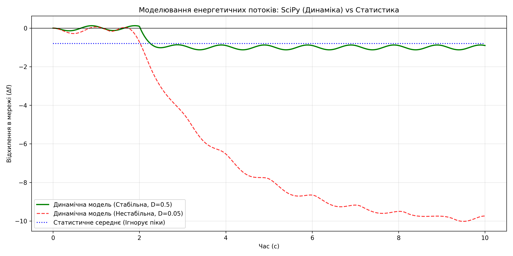

# Практична робота №4: Моделювання енергетичних потоків мережі
### Виконав студент групи ТВ-33 Чернявський Максим
## Мета роботи
Реалізувати математичну симуляцію енергетичних потоків у мережі за допомогою диференціальних рівнянь. Оцінити вплив параметрів системи на її стабільність та порівняти динамічний підхід зі статистичним аналізом.

## Використані методи та технології
* **Python, SciPy (`solve_ivp`):** Для чисельного розв'язання звичайних диференціальних рівнянь (ЗДР).
* **Математична модель:** Використано рівняння балансу потужностей (спрощене рівняння ротора), де зміна частоти в мережі залежить від інерції системи (`M`), коефіцієнта демпфування (`D`) та різниці між генерацією і навантаженням.

## Аналіз результатів та візуалізація

Нижче наведено графік симуляції, який порівнює реакцію мережі на різкий стрибок споживання (на 2-й секунді) за різних умов:

### 1. Вплив параметрів на стабільність (Динамічна модель)
* **Стабільна мережа (зелена лінія, D=0.5):** Мережа з високим рівнем демпфування успішно "гасить" збурення. Після стрибка навантаження частота трохи просідає, але швидко стабілізується на новому безпечному рівні.
* **Нестабільна мережа (червона пунктирна лінія, D=0.05):** Низький коефіцієнт демпфування призводить до катастрофічного падіння частоти. Система йде в рознос (осциляції посилюються), що в реальній енергосистемі означало б неминучий блекаут.

### 2. Порівняння зі статистичним аналізом (з ПР №3)
* **Статистичне середнє (синя пунктирна лінія):** Метод усереднення показує лише загальний баланс за весь період симуляції (констатує незначне відхилення). Він **повністю ігнорує** критичне падіння на початку збурення. 

## Висновок
Чисельне моделювання за допомогою `SciPy` є набагато ефективнішим інструментом для аналізу стабільності енергомереж, ніж статистичний аналіз. Динамічна модель дозволяє побачити реальні "перехідні процеси" в критичні секунди після аварії чи стрибка споживання, оцінити здатність системи до самовідновлення (демпфування) та запобігти потенційним блекаутам.