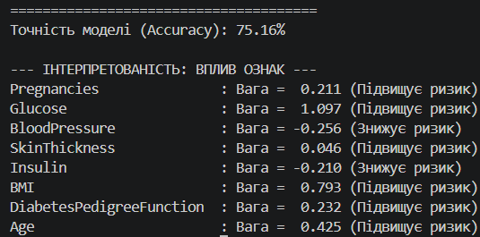

# Практична робота №5: Побудова бінарної класифікаційної моделі для медичних даних
### Виконав студент групи ТВ-33 Чернявський Максим
## Мета роботи
Розробити та навчити модель бінарної класифікації для прогнозування наявності захворювання за медичними показниками пацієнта. **Головна вимога:** алгоритм має бути реалізований самостійно "з нуля" без використання спеціалізованих бібліотек машинного навчання.

## Набір даних (Dataset)
Для тестування алгоритму використано класичний медичний датасет: **Pima Indians Diabetes Database** (файл `diabetes.csv`). 
Набір містить дані про пацієнтів та 8 клінічних показників (рівень глюкози, артеріальний тиск, ІМТ, вік тощо). Цільова змінна (`Outcome`) вказує на наявність цукрового діабету (1 - хворий, 0 - здоровий).

## Математична реалізація алгоритму
Для вирішення задачі було обрано алгоритм **Логістичної регресії**. Весь пайплайн (від нормалізації до градієнтного спуску) написаний виключно на базі математичних розрахунків бібліотеки `numpy`. 

Основою класифікатора є лінійна комбінація ознак, яка пропускається через функцію активації сигмоїду, що перетворює вихідний сигнал на ймовірність:
$$\sigma(z) = \frac{1}{1 + e^{-z}}$$

Навчання моделі відбувається за допомогою методу **градієнтного спуску** (Gradient Descent) на 3000 ітерацій. На кожній ітерації алгоритм оновлює ваги ($w$) і зміщення ($b$) у напрямку антиградієнта:
$$dw = \frac{1}{N} X^T (\hat{y} - y)$$

## Функціонал
1. `train_test_split_custom()` — підпрограма для рандомного поділу даних на тренувальну та тестову вибірки (80% / 20%).
2. `standardize_custom()` — Z-score нормалізація ознак, необхідна для рівномірного та стабільного кроку градієнтного спуску.
3. Клас `CustomLogisticRegression` з методами `fit()` (навчання) та `predict()` (класифікація).

##  Результати та інтерпретованість
На тестовій вибірці реальних даних модель досягла точності класифікації (Accuracy) на рівні **75.16%**, що є відмінним показником для самописної математичної моделі.

Нижче наведено результати роботи скрипту:



Оскільки логістична регресія є прозорою моделлю (white-box), ми змогли дослідити вплив кожної клінічної ознаки на результат. Аналіз вагових коефіцієнтів показав:
1. **Glucose (Рівень глюкози):** Має найвищу позитивну вагу (1.097). Це найголовніший фактор, що сильно підвищує ризик захворювання.
2. **BMI (Індекс маси тіла):** Другий за значущістю фактор ризику (вага 0.793).
3. **Age (Вік), DiabetesPedigreeFunction (Спадковість) та Pregnancies (Кількість вагітностей):** Також мають позитивну вагу та підвищують ризик наявності діабету.
4. **BloodPressure та Insulin:** У нашій лінійній комбінації отримали незначний від'ємний вплив, що є особливістю розподілу в даному конкретному датасеті.

##  Як запустити проект
1. Переконайтеся, що файл `diabetes.csv` лежить у тій самій папці, що й скрипт.
2. Запустіть скрипт:
   ```bash
   python Lr5.py