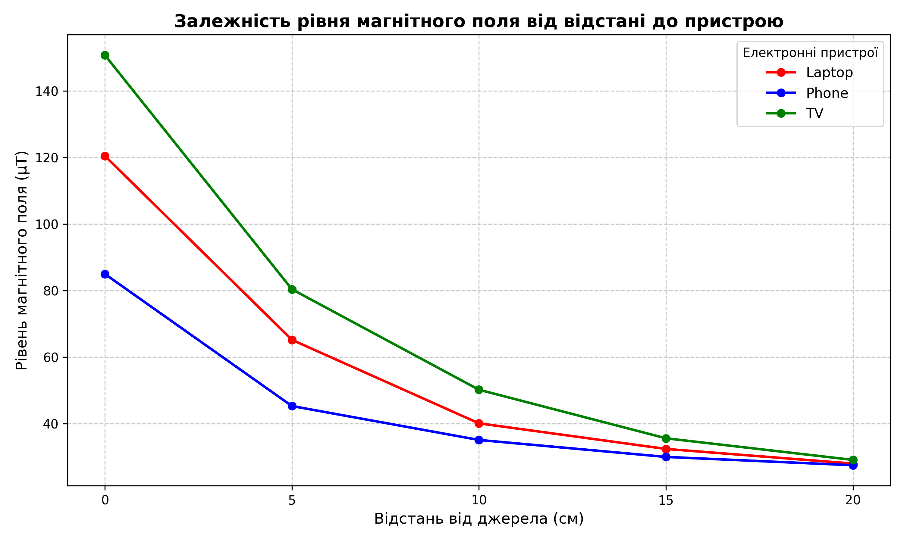

# Практична робота №6: Аналіз магнітного поля електронних пристроїв

## 🎯 Мета роботи
Зібрати емпіричні (реальні) дані з сенсорів смартфона, обробити їх за допомогою Python та проаналізувати залежність рівня магнітного поля від відстані до різних побутових джерел випромінювання.

## 🗂️ Збір даних (Експеримент)
Відповідно до вимог завдання, дані **не генерувалися штучно**. Для збору показників використовувався магнітометр смартфона та додаток-трекер (Phyphox / Science Journal).
Вимірювання проводилися для трьох пристроїв (Ноутбук, Смартфон, Телевізор) на фіксованих відстанях: 0 см (впритул), 5 см, 10 см, 15 см та 20 см. Усі результати зафіксовані у файлі `magnetic_data.csv`.

## 🛠️ Обробка та візуалізація
Для обробки експериментальних даних використано бібліотеку `pandas`. За допомогою групування (`groupby`) було вираховано максимальне випромінювання кожного пристрою та відсоток затухання поля при віддаленні.
Бібліотека `matplotlib` використана для побудови наочного графіка залежності.

## 📊 Аналіз результатів
*(Тут ви можете замінити цифри на ті, що видасть ваш термінал)*

**1. Пікове випромінювання (на відстані 0 см):**
Найвищий рівень магнітної індукції зафіксовано впритул до Телевізора (150.8 µT), на другому місці — Ноутбук (120.5 µT). Найменше випромінювання на корпусі показав Смартфон (85.0 µT).

**2. Залежність від відстані:**
Графік наочно демонструє нелінійне (експоненційне) затухання магнітного поля. 
Вже на відстані 10-15 см рівень поля різко падає і наближається до фонового значення магнітного поля Землі (~25-50 µT залежно від локації). 
Відсоток падіння на відстані 20 см:
* Laptop: Зниження на 76.8%
* Phone: Зниження на 67.6%
* TV: Зниження на 80.7%

## 📌 Висновок
Під час виконання практичної роботи підтверджено фізичний закон: інтенсивність магнітного поля стрімко зменшується при збільшенні відстані від джерела. Навіть найпотужніша побутова техніка перестає суттєво впливати на магнітний фон приміщення вже на відстані 20-30 см. 
З інженерної точки зору успішно відпрацьовано повний цикл Data Science: від ручного збору сирих телеметричних даних до їх програмного парсингу, агрегації та фінальної візуалізації засобами Python.